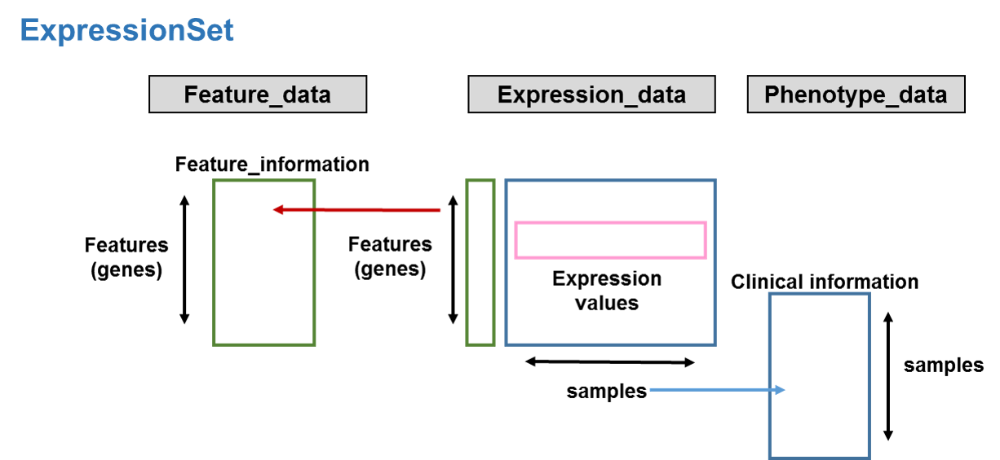
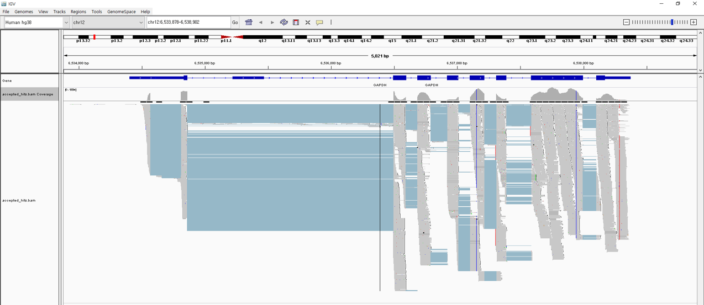

Rtutorial_week3
========================================================
author: Ji-Hye Choi
date: 2017.05.17
width: 2000

<style>

/* slide titles */
.reveal h3 { 
  font-size: 70px;
}

/* heading for slides with two hashes ## */
.reveal .slides section .slideContent h2 {
   font-size: 50px;
   font-weight: bold;
}

/* ordered and unordered list styles */
.reveal ul, .reveal ol { font-size: 50px; }


</style>


Review week2 (1): ExpressionSet 
========================================================




Review week2 (1): ExpressionSet 
========================================================

 1. Read cufflinks output files of each sample
 2. Make data
    + Expression data: FPKM matrix (gene by sample)
    + Feature data: Gene info data.frame 
    + Phenotype data: Sample info data.frame
 3. ExpressionSet(Expression, Phenotype, Feature)


Review week2 (2): DEG and GO analysis 
========================================================

 1. preprocess eset
    + log2
    + aggregation (gene symbol)
 2. Identify DEG
    + mean of groups (T, N)
    + fold change (mean.T - mean.N)
    + Up/Down DEG by fold change cutoff
 3. GO analysis
    + ligrary(gProfileR)


TODAY
========================================================

 * Load expression set
 * Identify up/down DEG (Tumor vs Normal)
 * GO using DAVID software
 * Network (GENEMANIA)
 * Gene set enrichment analysis (GSEA)
 * IGV


Web-based analysis tools
========================================================

* GO analysis: DAVID (https://david.ncifcrf.gov/home.jsp)
    + Functional Annotation Chart: Fisher's Exact Test (P-value)
    + Functional Annotation Clustering: Fuzzy clustering

  
* Network analysis: GENEMANIA (http://genemania.org/)
    + Physical interection
    + Genetic interection
    + Pathway interection
    + ... 


GSEA analysis
========================================================
 * Group comparision (e.g., T vs N) 
    + GSEA java program or R function, genepattern (https://genepattern.broadinstitute.org/gp)
    + input files: expression (.gct), geneset signature (.gmt), class (.cls)
    + http://software.broadinstitute.org/cancer/software/genepattern/file-formats-guide
    + permutation type: gene_set
    + collapse dataset: false
    

GSEA input in R
========================================================
 * .gct file (remove NA value)

```
fn=file.path(getwd(), "result/expr.gct")
cat("#1.2\n", file=fn)
cat(c(nrow(fil.eset),"\t",ncol(fil.eset),"\n"), sep="", file=fn, append=T)
res=cbind(as.data.frame(rownames(fil.eset)), rownames(fil.eset), exprs(fil.eset))
colnames(res)[1:2]=c("NAME", "DESCRIPTION")
write.table(res, file=fn, append=T, sep="\t", quote=F, row.names=F, col.names=T)
```


GSEA input in R
========================================================
 * .cls

```
fn=file.path(getwd(), "result/TvsN.cls")
pData(fil.eset)$class=factor(c("T","T","T","N","N","N"), levels=c("T","N"))
n.cls=names(table(pData(fil.eset)$class))
cat(paste(length(pData(fil.eset)$class),length(n.cls),"1",sep=" "),"\n", file=fn)
cat("#", file=fn, append=T)
cat(paste(n.cls,sep=" "),"\n", file=fn, append=T)
cat(paste(pData(fil.eset)$class,sep=" "),"\n", file=fn,append=T)
```
 
GSEA input in R
========================================================
 * .gmt
 
```
for (i in 1:length(siglist)){
  cat(names(siglist[i]), "NA", siglist[[i]],"\n",append=T, sep="\t",file=fn)
}
```
 
 

IGV
========================================================

http://software.broadinstitute.org/software/igv/




Next 
========================================================

* GRange, getSequence
* Sequence enrichment
* RMarkdown
* ggplot


Project 
========================================================

* Samples
  + Control: HepG2
  + wtSF3B3: SF3B3 overexpression in HepG2
  + mutSF3B3: mutant form SF3B3 overexpression in HepG2
  
* Phenotype
  + Contrl: liver cancer
  + wtSF3B3: proliferation, migration, invasion (+)
  + mutSF3B3: proliferation, migration, invasion (++)
  + previous study: https://www.ncbi.nlm.nih.gov/pubmed/28038442
